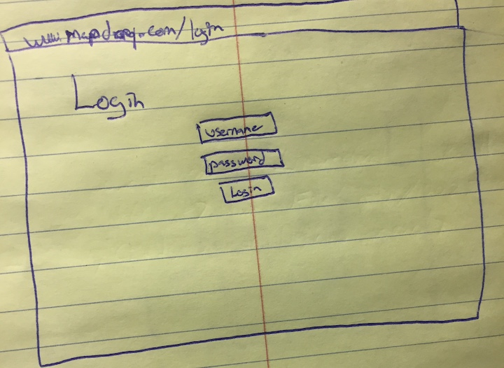
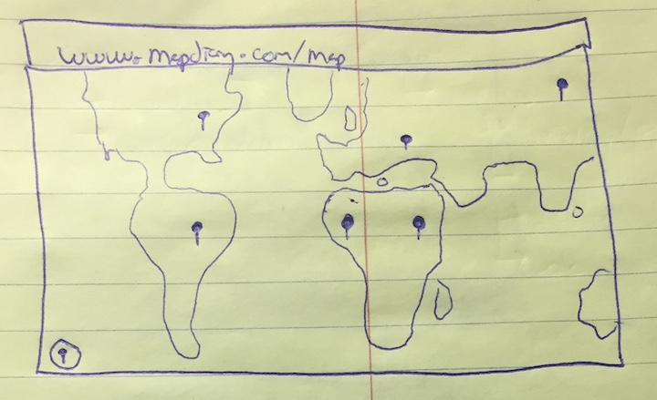
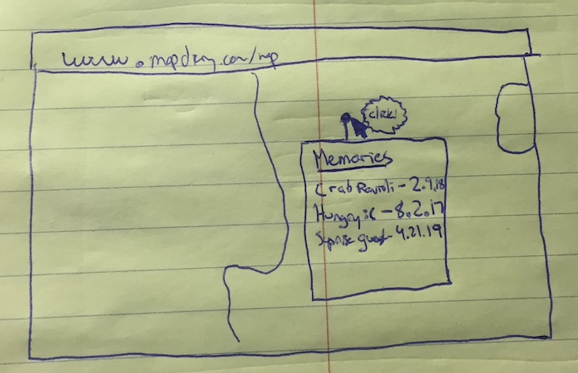
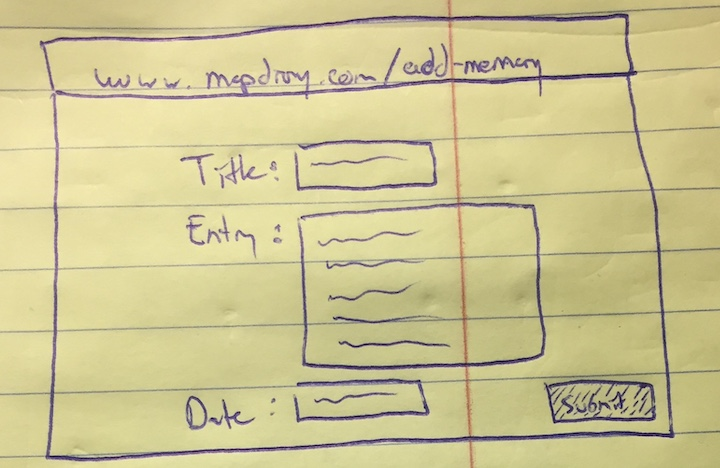
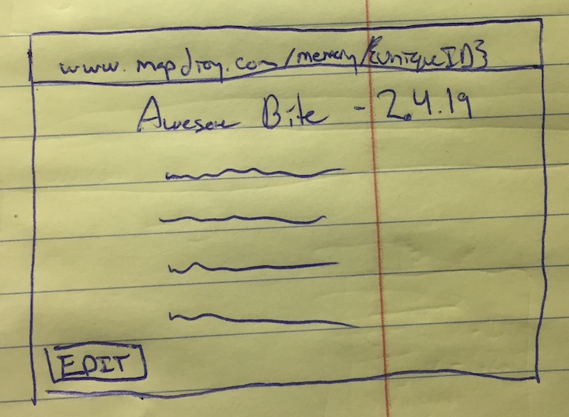
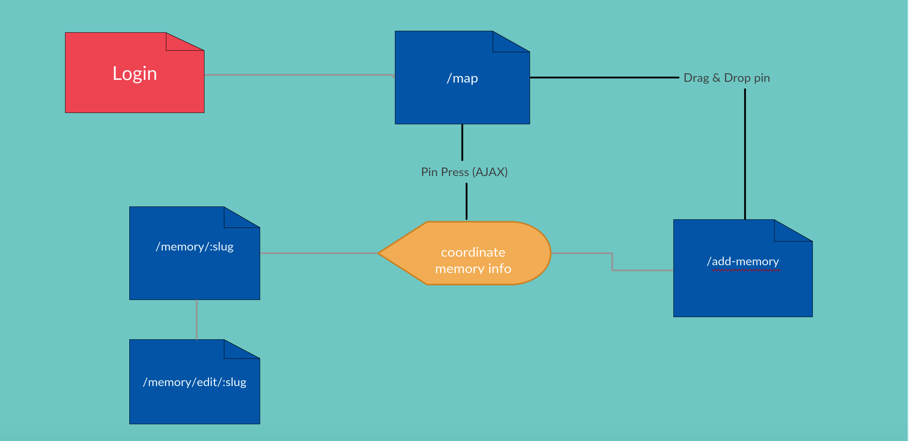

# Map Diary 

## Overview


Diaries are old school. Pencil and paper with chronologically sorted events have little interest to our over stimulated 21st century brains. And what if you want to jump to a specific memory? I'm not sure about you but my diary doesn't have a table of contents...

A solution to our problem lies in reinventing the diary from the ground up with: __Map Diary__.
The map diary provides an easy way for users to organize their wonderful diary exerpts by locations on a map. When wanting to look back at a single moment all one has to do is remember where it took place and sort through the memories they have recorded at those coordinates. 


## Data Model

We will be keeping track of users, coordinates, and memories. 

Users will have a list (by reference) of coordinates they have visited.
Coordinates will have a list (by refercence) of memories recoreded there. Because multiple users can record memories at the same location, the memory objects will need to include the unique identifier attributed to the user that created the memory. 


An Example User:

```javascript
{
  username: "shannonshopper",
  hash: // a password hash,
  coords: // an array of references to Coordinate documents
}
```
An Example Coordinate:

```javascript
{
  lat: -10.04,
  long: 43.13,
  memories: // an array of references to Memory documents
}
```
An Example Memory:

```javascript
{
  title: "rainy shrine"
  text: "i love this place",
  date: //time memory is created,
  createdBy: // unique username of the creator of the memory
}
```


## [First draft of db.js](src/db.js) 


## Wireframes


__/login__ - page for logging into the site.



__/map__ - page for viewing the map and coordinates with diary entries.





__/add-memory & /edit-memory__ - page for adding new memory. User is only directed here after placing a new pin on the map and therefore don't need to specify the location on this form.



__/memory/:slug - displays info for a particular memory.



## Site map



## User Stories or Use Cases

1. as non-registered user, I can register a new account with the site
2. as a user, I can log in to the site
3. as a user, I can view the locations I've recorded memories at
4. as a user, I can view and edit the memories at these locations
5. as a user, I can add new locations to the map

## Research Topics


* (5 points) Map API
    * I'll be using leaflet to incorporate map functionality
    * https://leafletjs.com/
    * Will incorporate different plugins
    * Allow drag and drop
    * Geofencing
    * Current location
* (3 points) AJAX DOM Controlled Pop-up
    * Want to fetch entry list on click of coordinates
    * This is better for memory usage and scalability


8 points total out of 8 required points


## [Main Project File](src/app.js) 


